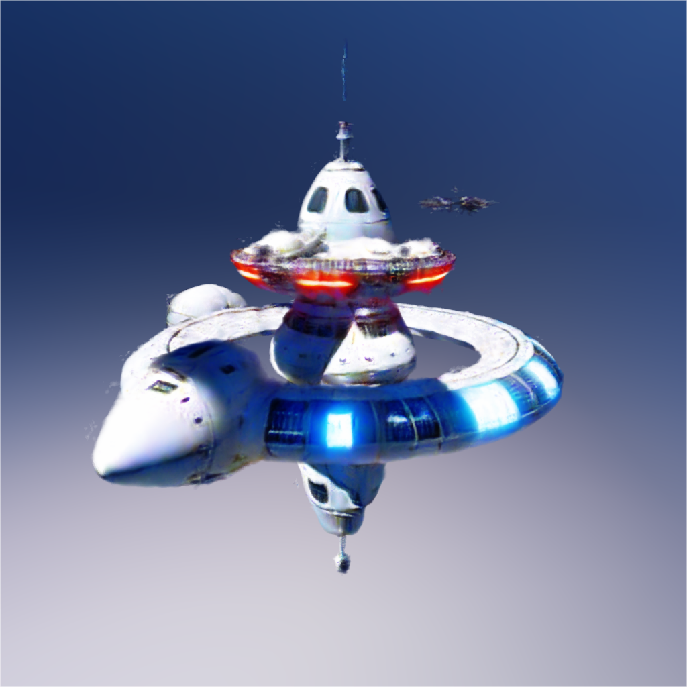
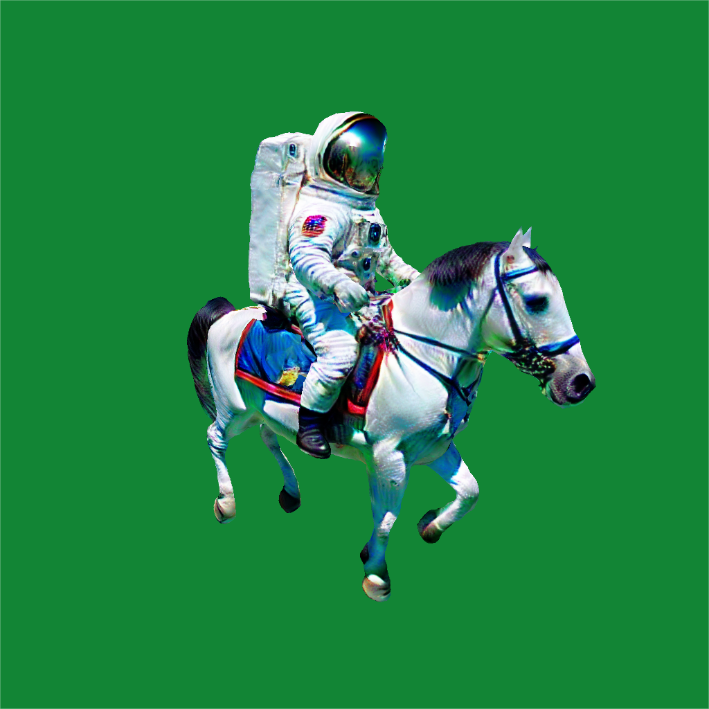
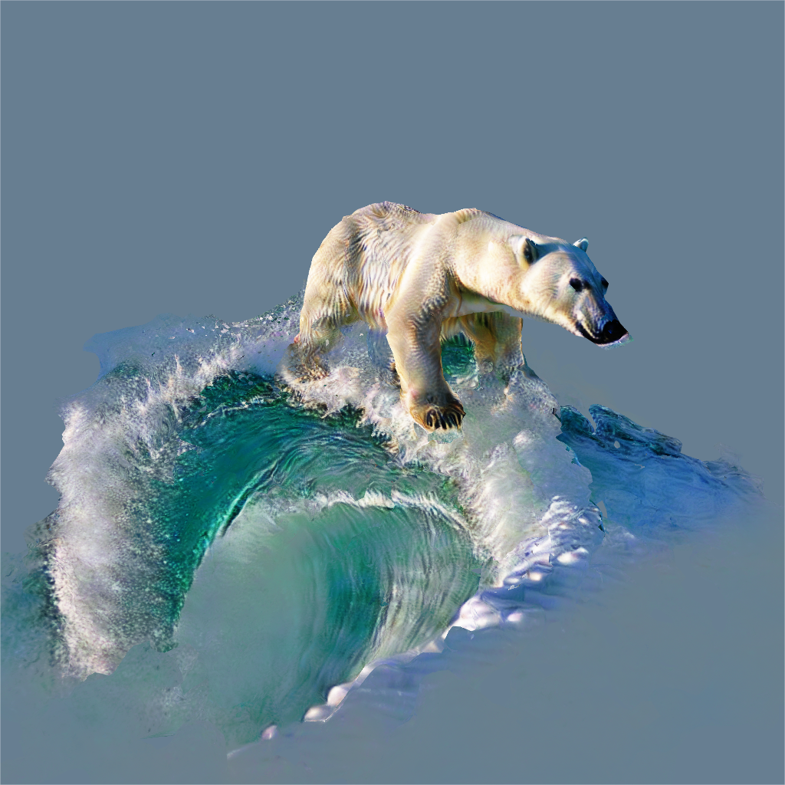
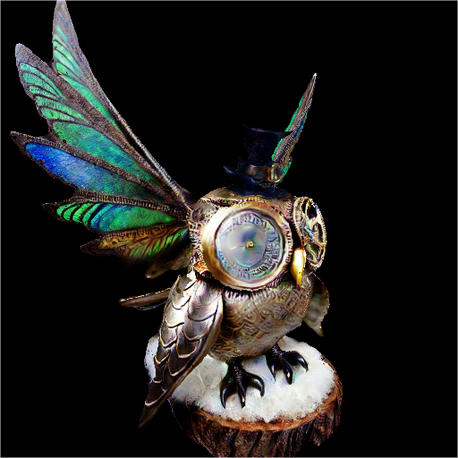

# Consistent Flow Distillation
Official Implementation for Consistent Flow Distillation for Text-to-3D Generation

[project page](https://runjie-yan.github.io/cfd/) | paper

<div style="display: flex; justify-content: space-between;">
  
  
  
</div>
<br>
<div style="display: flex; justify-content: space-between;">
  
  
  
</div>

The code is built upon [threestudio](https://github.com/threestudio-project/threestudio)

## Installation
- Create a virtual environment:
```sh
conda deactivate
conda remove -n cfd --all -y
conda create -n cfd python=3.10 -y
conda activate cfd
```

- Install for cuda 11.8
```sh
conda install -c conda-forge cudatoolkit-dev -y # optional, cuda_runtime_api.h
conda install cudatoolkit=11.8 -y # optional
# torch2.1.1+cu118
pip install torch==2.1.1+cu118 torchvision --extra-index-url https://download.pytorch.org/whl/cu118
pip install ninja # optional, speed up compilation
pip install -r requirements-118.txt
```

- Install for cuda 12.1
```sh
conda install -c conda-forge cudatoolkit-dev -y # optional, cuda_runtime_api.h
conda install nvidia/label/cuda-12.1.0::cuda-toolkit -y # optional
# torch2.2.1+cu121
pip install torch==2.2.1+cu121 torchvision --extra-index-url https://download.pytorch.org/whl/cu121
pip install ninja # optional, speed up compilation
pip install -r requirements-121.txt
```

## Quick Start
2 stage nerf generation with MVDream and Stable Diffusion
```sh
# with soft shading (at stage 1), requires ~40 GB
python scripts/run_all_stage.py --prompt "A steampunk owl with mechanical wings" --use_perp_neg
# without soft shading, requires ~24 GB
python scripts/run_all_stage.py --prompt "A steampunk owl with mechanical wings" --use_perp_neg --raw 
```

3 stage mesh generation with MVDream and Stable Diffusion
```sh
# with soft shading (at stage 1), requires ~40 GB
python scripts/run_all_stage.py --prompt "A steampunk owl with mechanical wings" --use_perp_neg --mesh
# without soft shading, requires ~24 GB
python scripts/run_all_stage.py --prompt "A steampunk owl with mechanical wings" --use_perp_neg --raw --mesh
```

## Other Features
### Code Demo of Clean Flow SDE
Refer to [SDE.ipynb](./SDE.ipynb) for the implementation of algorithm 3 in the paper (without 2nd order correction). This is a diffusion model sampling algorithm that corresponds to Clean Flow SDE.

### 2D generation with CFD
2d playground with cfd
```sh
python launch.py --train --gpu 0 --config configs/cfd/2d.yaml system.prompt_processor.prompt="A cute cat"
```

### A modified version of [stable nerf render](https://github.com/DSaurus/threestudio-stable-nerf-renderer) to run 512 nerf rendering stably on RTX-3090

## Citing CFD
If you find CFD helpful, please consider citing:
